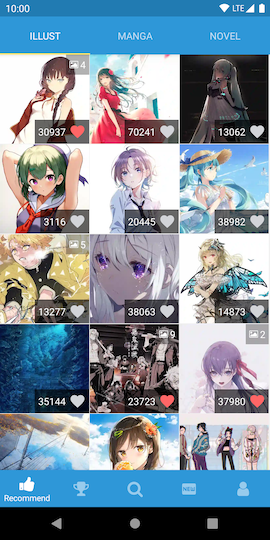
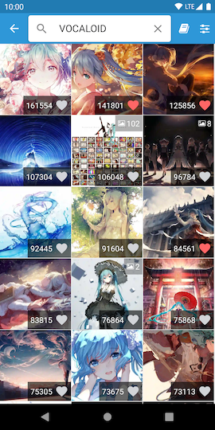
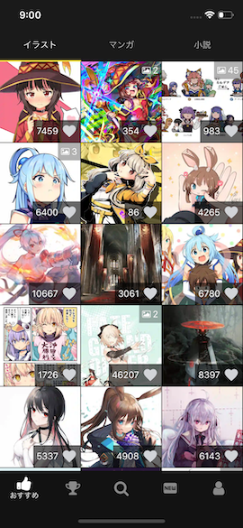

# PxView


[](https://github.com/prettier/prettier)
[](https://github.com/alphasp/pxview/pulls)

Unofficial Pixiv app client for Android and iOS, built with React Native.


## Screenshots






## Features
- Bottom navigation
- Ranking
	- Enjoy the latest popular works.
 	- Find trending works over the past day, week, or month.

- New Works
 - Check out new works from the users you're following.
 - View new works from your friends or all pixiv users

- Search
	- Search for your favourite works with keyword.
 	- Search for popular titles or characters.
 	- Search illustrations/novels by tags, titles or id.
 	- Search for users.
 	- View the latest trends on pixiv with "Featured Tags"
- One tap button to save multiple images
- Mute and highlight tags (New in version 1.6)
- Tag Encyclopedia (New in version 1.6)
- Support localization (English, Japanese, Chinese)
- Ad free


## Download 
<a href='https://play.google.com/store/apps/details?id=com.utopia.pxview&pcampaignid=MKT-Other-global-all-co-prtnr-py-PartBadge-Mar2515-1'></a>


## Getting Started
1. `$ git clone https://github.com/alphasp/pxview`
2. `$ npm install`
3. `$ npm run pod-install`
4. Set up Firebase account on [Firebase](https://console.firebase.google.com/). 
	- Create a new project, and enable Google Analytics
	- [Android] Add android app on firebase console, download `google-services.json` and move to `/android/app` folder
	- [iOS] Add iOS app on firebase console, download `GoogleService-Info.plist` and move to `/ios` folder
	- (Optional) In app feedback feature: Create Realtime Database from firebase console and enable rules to write to `feedback`
5.	Run the app
	- [Android] `$ npm run android`
	- [iOS] `$ npm run ios`

## Application Architecture
- [redux](https://github.com/reactjs/redux) is a predictable state container for JavaScript apps, 
- [redux-saga](https://github.com/yelouafi/redux-saga/) is a library that aims to make side effects (i.e. asynchronous things like data fetching and impure things like accessing the browser cache) in React/Redux applications easier and better.
- [redux-persist]() is use to persist and rehydrate a redux store. It is use in this project to persist redux store in react-native `AsyncStorage` and rehydrate on app start.
- [react-navigation](https://github.com/react-community/react-navigation) is the official react-native navigation solution. It is extensible yet easy-to-use
- [react-native-paper](https://github.com/callstack/react-native-paper) is a Material Design library for React Native (Android & iOS)
- [react-native-localization](https://github.com/stefalda/ReactNativeLocalization) is a library to localize the ReactNative interface
- [react-native-firebase](https://github.com/invertase/react-native-firebase) is a A well-tested feature-rich modular Firebase implementation for React Native. Supports both iOS & Android platforms for all Firebase services. It is use in this project for crash reporting and analytics.
- [normalizr](https://github.com/paularmstrong/normalizr) normalizes nested JSON according to a schema
- [reselect](https://github.com/reactjs/reselect) is a selector library for Redux that is efficient and can compute derived data, allowing Redux to store the minimal possible state.
- And more..


## Tests
```
$ npm test
```

## Related Projects
[pixiv-api-client](https://github.com/alphasp/pixiv-api-client) - Api client for Pixiv

## Contribute
1. Fork [pxview](https://github.com/alphasp/pxview)
2. Follow steps in Getting Started to install dependencies and setup.
3. Make your code changes
4. `npm run lint` to lint and prettify codes, make sure all eslint warning and errors are fixed.
5. `npm test` to run test, make sure all tests are passed.
6. Commit and push your codes, then create a pull request.

## Donations
If you like this application and think it is useful, you may consider making a donation

### Amazon eGift Card (Amazon US or Amazon Japan)
Send to gmerudotcom@gmail.com via email delivery option

### Bitcoin


34nfe2Jm8Tg8f8YfE4Vk12JGeXDqC4b5pU

### Paypal
USD

[](https://www.paypal.com/cgi-bin/webscr?cmd=_s-xclick&hosted_button_id=4FEHX7PTHQTQY)

JPY

[](https://www.paypal.com/cgi-bin/webscr?cmd=_s-xclick&hosted_button_id=A7TA6Y8999S72) 


## License

MIT